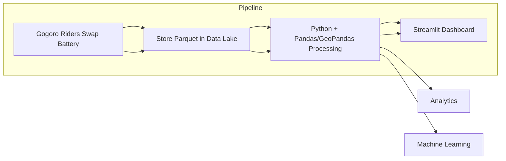

# Gogoro Living Circle – Gaussian Heatmap & Streamlit Dashboard 🛵

## 📌 Overview

This project provides:

1. **Gaussian-based spatial modeling** – A custom implementation of 2D Gaussian functions for geospatial interpolation. It can generate raster heatmaps, shapefiles, and GeoJSON outputs from scooter trip data.

2. **Streamlit dashboard** – An interactive web interface for visualizing per-user data, risk analysis, and aggregated user behavior.

The core idea is to model **swap-in** and **swap-out** scooter battery locations, compute probability heatmaps, and provide insights into mobility patterns.

## 🚀 Features

* Gaussian Class

  * Fit geospatial data points with a 2D Gaussian function.
  * Predict probabilities for any given coordinates.
  * Export results as raster (`.tif`), shapefile (`.shp`), or feather (`.feather`) formats.
  * Support for CRS transformation (`EPSG:3826` ↔ `EPSG:4326`).
  * Batch processing with progress bar (`tqdm`).

* Streamlit App

  * Navigation between different views:

    * PerUser – individual-level trip analysis.

    * Risk – identify risky areas.

    * AllUser – aggregate view of multiple users.

  * Custom styling and navigation bar for user-friendly interface.
 
## 📂 Project Structure
```bash
project/
│── gaussian.py          # Gaussian class for geospatial modeling
│── main.py              # Entry point to run Gaussian execution
│── app.py               # Streamlit app entry point
│── utils.py             # Utility functions (CSS, navigation, etc.)
│── views/
│   ├── PerUser.py       # Streamlit view – per-user analysis
│   ├── Risk.py          # Streamlit view – risk analysis
│   └── AllUser.py       # Streamlit view – all users view
│── data/                # Input CSV files
│── output/              # Exported GeoJSON, Shapefiles, Rasters
│── README.md            # Project documentation
```

## Simplified Mermaid Diagram


```yaml

This diagram is lightweight, auto-renders in GitHub, and avoids keeping image files.

---

## ✅ Which is Best?
- The **screenshot version** (Option A) is richer — with icons, Chinese annotations, and visually appealing for non-technical audiences.  
- The **Mermaid diagram** (Option B) is cleaner, more maintainable, and works natively inside GitHub README without external image dependencies.  

👉 For your project, I recommend **including both**:
- Use the **screenshot** for presentation & visual clarity.
- Add the **Mermaid diagram** for contributors and developers who read the README in GitHub directly.

---

Do you want me to **merge both diagrams into the README draft I wrote earlier**, so the visuals sit right under the “📊 Example Workflow” section?
```

## 🔧 Installation
1. Clone the repository:
   ```bash
      git clone https://github.com/<your-repo>.git
      cd <your-repo>

   ```
2. Install dependencies:
   ```bash
      pip install -r requirements.txt
   ```

## Usage
1. Run Gaussian Model
  ```bash
  python main.py
  ```
This will:
* Load input data (`XYdis_10users_30times_max.csv`).

* Generate swap-in and swap-out buffers as shapefiles.

* Export raster heatmaps to `/output/.`

2. Run Gaussian Model
  ```bash
  streamlit run app.py
  ```
This will:
Then open the browser at: **`http://localhost:8501`**


## 📊 Example Workflow
1. Gaussian model fits scooter trip data.
2. Generates probability heatmap (`.tif`) and shapefile buffers.
3. Dashboard lets you:
   * View per-user battery swap activity.
   * Analyze high-risk areas.
   * Compare across all users.

## 📝 Notes
* Make sure input CSV files are placed under `./data/.`
* Output files will be stored in `./output/.`
* CRS default is `EPSG:3826`; you can change it in `Gaussian.to_2D()`.


## 📖 References

* [Two-dimensional Gaussian function](https://en.wikipedia.org/wiki/Gaussian_function#Two-dimensional_Gaussian_function)

* [Streamlit Documentation](https://docs.streamlit.io/)


